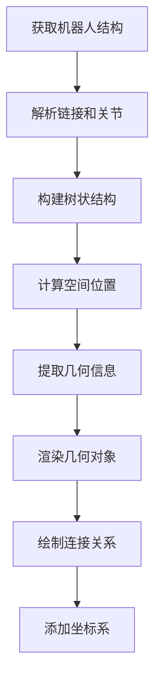

# AssetX 几何渲染架构分析

## 概述

AssetX的几何渲染系统采用分层组合架构，旨在为USD资产提供灵活而强大的可视化能力。系统支持多种渲染后端和不同类型的几何对象，特别针对机器人可视化进行了优化。

## 架构组件

### 1. 核心渲染架构

```
GeometryRenderer (统一入口)
├── RenderBackend (后端管理)
├── MatplotlibPlotter (基础绘图)
└── RobotVisualizer (机器人可视化)
```

### 2. 渲染后端支持

#### 主要后端
- **Previewer**: 首选的3D预览后端（如果可用）
- **Matplotlib**: 备用的2D/3D绘图后端
- **未来扩展**: 预留支持OpenGL、Three.js等

#### 后端选择策略
```python
# 优先级顺序
1. Previewer（高质量3D渲染）
2. Matplotlib（通用可视化）
3. 无后端（错误处理）
```

### 3. 几何对象类型

#### 基础几何体
- **AssetMesh**: USD几何网格对象
- **AssetXform**: 变换节点
- **MeshReference**: 外部网格引用

#### 支持的几何形状
- Box（立方体）
- Sphere（球体）
- Cylinder（圆柱体）
- Mesh（自定义网格）

## 机器人可视化模式

### 1. 渲染流程



### 2. 几何信息提取策略

#### 当前实现
目前的机器人可视化器主要使用**默认几何形状**：

```python
def _render_smart_default_geometry(self, ax, position, color, link_name):
    """基于链接名称的智能几何推断"""
    # 根据链接名称判断几何类型
    if 'base' in link_name.lower():
        # 基座 - 使用较大的圆柱体
        geometry = 'cylinder'
        size = [0.1, 0.1, 0.15]
    elif 'gripper' in link_name.lower() or 'finger' in link_name.lower():
        # 夹爪 - 使用小长方体
        geometry = 'box'
        size = [0.02, 0.1, 0.03]
    else:
        # 其他链接 - 使用标准长方体
        geometry = 'box'
        size = [0.05, 0.05, 0.08]
```

#### 问题分析
**目前缺失对USD `visuals` prim的处理**：

1. **未读取视觉几何**: 没有解析USD文件中的`def "visuals"`子节点
2. **缺少真实形状**: 所有链接都使用简化的几何形状
3. **材质信息丢失**: 没有提取颜色、纹理等视觉属性

### 3. USD Visuals 结构分析

以Franka机器人为例，USD文件包含丰富的视觉信息：

```usd
def Xform "panda_link0" {
    # 位置和物理属性
    float3 xformOp:translate = (...)
    
    def "visuals" (
        references = @omniverse://...franka_visuals.usd@</panda_link0_visuals>
    ) {
        # 真实的视觉几何定义
        # - 网格数据
        # - 材质属性  
        # - 纹理信息
    }
    
    def "collisions" (
        references = @omniverse://...franka_collisions.usd@</panda_link0_collisions>
    ) {
        # 碰撞几何定义
    }
}
```

## 改进建议

### 1. 增强几何提取系统

#### 优先级策略
```python
def _extract_geometry_info(self, link):
    """增强的几何信息提取"""
    # 1. 优先：USD visuals 子节点
    visual_geom = self._extract_visual_geometry(link)
    if visual_geom:
        return visual_geom
    
    # 2. 备选：collision 几何
    collision_geom = self._extract_collision_geometry(link)
    if collision_geom:
        return collision_geom
    
    # 3. 最后：智能默认几何
    return self._generate_smart_default_geometry(link)
```

#### 视觉几何提取
```python
def _extract_visual_geometry(self, link):
    """提取USD visuals几何信息"""
    try:
        # 查找 visuals 子节点
        visuals_prim = link.get_child("visuals")
        if not visuals_prim:
            return None
        
        # 解析几何类型和属性
        geometry_info = {
            'type': 'mesh',  # 或 box, sphere, cylinder
            'mesh_file': None,
            'size': [1, 1, 1],
            'material': {
                'color': [0.7, 0.7, 0.7],
                'roughness': 0.5,
                'metallic': 0.0
            }
        }
        
        # 查找网格引用
        references = visuals_prim.get_references()
        if references:
            geometry_info['mesh_file'] = references[0].asset_path
        
        # 查找材质属性
        material_attrs = visuals_prim.get_attributes_by_namespace("material")
        if material_attrs:
            self._parse_material_attributes(material_attrs, geometry_info['material'])
        
        return geometry_info
    except Exception as e:
        logger.debug(f"提取视觉几何失败: {e}")
        return None
```

### 2. 渲染管道增强

#### 网格渲染支持
```python
def _render_mesh_geometry(self, ax, position, mesh_file, material):
    """渲染真实网格几何"""
    if self.backend.has_previewer:
        # 使用Previewer渲染高质量网格
        return self.backend.render_mesh_with_previewer(mesh_file, position, material)
    else:
        # 使用matplotlib渲染简化网格
        return self._render_simplified_mesh(ax, position, mesh_file, material)
```

#### 材质系统
```python
def _apply_material_properties(self, geometry, material):
    """应用材质属性"""
    if 'color' in material:
        geometry.set_color(material['color'])
    if 'roughness' in material:
        geometry.set_roughness(material['roughness'])
    if 'texture' in material:
        geometry.set_texture(material['texture'])
```

### 3. 完整的视觉渲染流程

```python
def render_complete_robot_with_visuals(self):
    """增强的机器人渲染（包含真实视觉）"""
    # 1. 获取所有链接
    links = self.asset.query.get_links()
    
    # 2. 为每个链接提取视觉信息
    for link in links:
        position = self._calculate_link_position(link)
        
        # 优先使用visuals几何
        visual_geom = self._extract_visual_geometry(link)
        if visual_geom:
            self._render_visual_geometry(ax, position, visual_geom)
        else:
            # 回退到默认几何
            self._render_default_geometry(ax, position, link)
    
    # 3. 渲染连接关系
    self._render_joint_connections(ax)
    
    # 4. 添加环境和光照
    self._setup_scene_environment(ax)
```

## 实现优先级

### 阶段1: 基础视觉支持
1. 实现`_extract_visual_geometry()`方法
2. 支持基本网格文件加载
3. 添加材质颜色支持

### 阶段2: 增强渲染质量
1. 支持外部网格文件引用解析
2. 实现材质属性系统
3. 添加光照和阴影

### 阶段3: 高级功能
1. 动画和运动支持
2. 物理模拟集成
3. 交互式操作界面

## 技术挑战

### 1. 外部引用处理
- USD文件中的`@omniverse://...@`引用需要网络访问
- 需要实现本地缓存和备用方案

### 2. 网格文件格式
- 支持多种格式：.usd, .obj, .ply, .stl等
- 需要格式转换和优化

### 3. 性能优化
- 大型机器人模型的渲染性能
- 内存管理和缓存策略

## 结论

当前的AssetX几何渲染系统具有良好的架构基础，但在USD视觉几何的处理上存在明显缺陷。通过实现上述改进建议，特别是对`def "visuals"`prim的完整支持，可以显著提升机器人可视化的真实性和实用性。

建议优先实现视觉几何提取功能，这将为用户提供更接近真实机器人外观的可视化体验。
